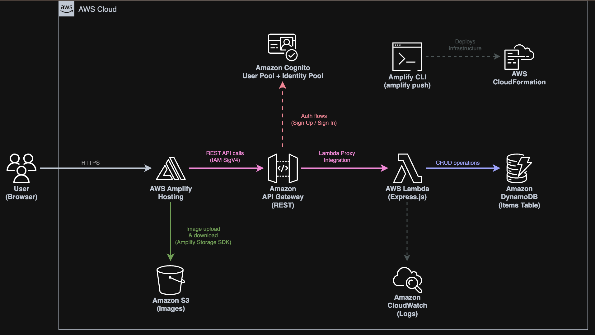
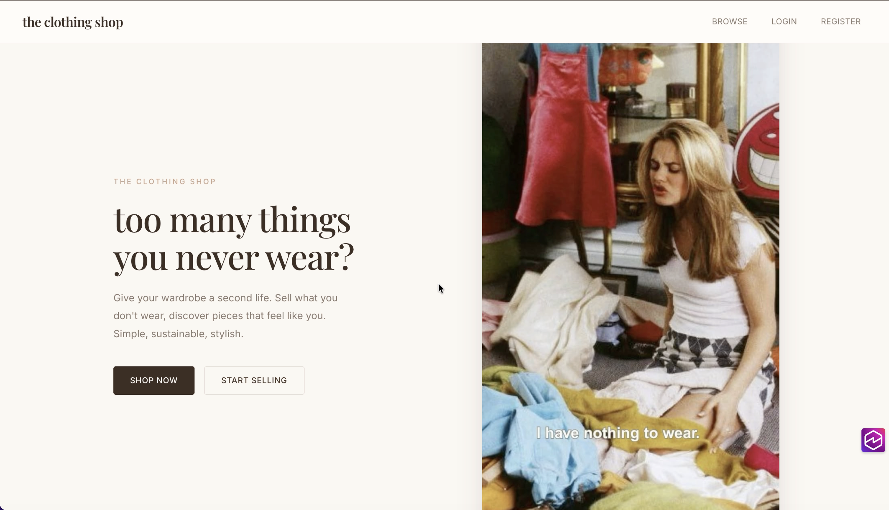
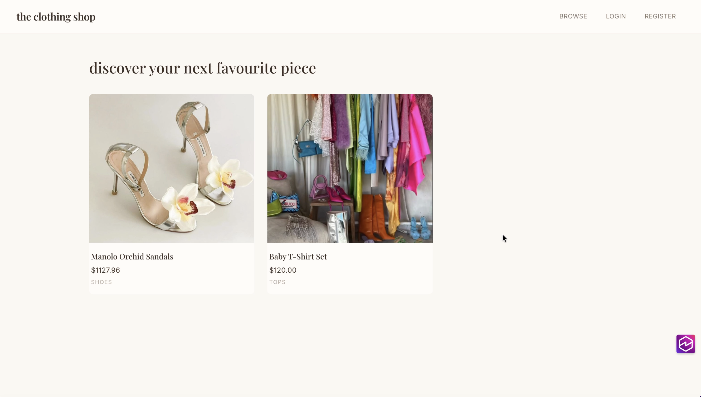

# 👗 The Clothing Shop — Cloud Computing Project

**Mara-Sofia Stan** | Masters: SIMPRE, Group 1147

- 🎥 Video presentation: https://youtu.be/O5ryHZXYBVw ([local copy](./the-clothing-shop-demo.mov))
- 🌐 Published app: https://main.di35hd11soq7w.amplifyapp.com

> ⚠️ **Access control enabled.** The hosted site is password-protected at the CloudFront edge to avoid unexpected AWS charges. The public `GET /items` endpoint is hit on every dashboard visit, so we gate the frontend to make sure only invited graders can trigger it. Username and password are shared separately with the course staff.

---

## 1. 📖 Introduction

The Clothing Shop is a serverless web application that allows users to buy and sell second-hand clothing items. Built entirely on AWS using the Amplify Gen 1 (v6) framework, The application features user registration and authentication, image uploads, a REST API backed by serverless functions, and a NoSQL database — all deployed and managed through AWS Amplify CLI.

**Tech stack:**
- Frontend: React + TypeScript (Vite)
- Hosting: AWS Amplify Hosting
- Authentication: Amazon Cognito (User Pool + Identity Pool)
- API: Amazon API Gateway (REST) + AWS Lambda (Node.js / Express.js)
- Database: Amazon DynamoDB
- File Storage: Amazon S3

### 🏗️ Architecture Diagram



---

## 2. 🖼️ App Preview

**Landing page** — unauthenticated visitors land here and can either sign up, log in, or jump straight to the public browse view.



**Browse page** — the catalog of listings, fetched from the public `GET /items` endpoint. No account required.



---

## 3. 💡 Problem Description

Online marketplaces for second-hand clothing are growing in popularity, but many existing platforms are either too complex for casual sellers or lack a clean, modern user experience. Students and young professionals often have clothing they no longer wear but have no simple way to list and sell these items within their community.

This project addresses that gap by providing a minimal, elegant marketplace where authenticated users can:
- Create listings with images, descriptions, prices, and categories
- Browse all available items without needing an account
- Edit or delete their own listings
- Upload and display clothing images

The solution leverages cloud-native AWS services to achieve a scalable, cost-effective, and fully serverless architecture with zero infrastructure management.

---

## 4. 🔌 API Description

The backend exposes a REST API through Amazon API Gateway, which proxies all requests to a single AWS Lambda function running an Express.js server via `@vendia/serverless-express`.

### Endpoints

| Method | Path | Auth Required | Description |
|--------|------|---------------|-------------|
| `GET` | `/items` | No | Retrieve all listings. Supports `?ownerId=` query parameter to filter by owner. |
| `GET` | `/items/{id}` | No | Retrieve a single listing by ID. |
| `POST` | `/items` | Yes (IAM) | Create a new listing. |
| `PUT` | `/items/{id}` | Yes (IAM) | Update an existing listing (owner only). |
| `DELETE` | `/items/{id}` | Yes (IAM) | Delete a listing (owner only). |

### Data Model (DynamoDB)

| Field | Type | Description |
|-------|------|-------------|
| `id` | String (Partition Key) | UUID, auto-generated |
| `title` | String | Listing title |
| `description` | String | Item description |
| `price` | Number | Price in EUR |
| `category` | String | Tops, Bottoms, Dresses, Outerwear, Shoes, Accessories, Other |
| `condition` | String | New, Like New, Good, Fair, Poor |
| `imageKeys` | List\<String\> | S3 object keys for uploaded images |
| `ownerId` | String | Cognito user sub (extracted from IAM auth context) |
| `createdAt` | String | ISO 8601 timestamp |
| `updatedAt` | String | ISO 8601 timestamp |

---

## 5. 🔄 Data Flow

### Request / Response Examples

**GET /items — List all items (public, no auth required)**

Request:
```
GET https://e0hyda081i.execute-api.eu-north-1.amazonaws.com/dev/items
```

Response (200):
```json
[
  {
    "id": "a1b2c3d4-e5f6-7890-abcd-ef1234567890",
    "title": "Vintage Denim Jacket",
    "description": "Lightly worn, size M",
    "price": 45,
    "category": "Outerwear",
    "condition": "Good",
    "imageKeys": ["public/user-sub/uuid-jacket.jpg"],
    "ownerId": "903cb97c-c071-7058-511f-54d74f4660eb",
    "createdAt": "2026-04-26T12:00:00.000Z",
    "updatedAt": "2026-04-26T12:00:00.000Z"
  }
]
```

**POST /items — Create a listing (authenticated)**

Request:
```
POST https://e0hyda081i.execute-api.eu-north-1.amazonaws.com/dev/items
Content-Type: application/json
Authorization: [IAM SigV4 signature via Cognito Identity Pool]

{
  "title": "Summer Dress",
  "description": "Floral print, size S, worn once",
  "price": 30,
  "category": "Dresses",
  "condition": "Like New",
  "imageKeys": ["public/903cb97c-.../uuid-dress.jpg"]
}
```

Response (201):
```json
{
  "id": "b2c3d4e5-f6a7-8901-bcde-f12345678901",
  "title": "Summer Dress",
  "description": "Floral print, size S, worn once",
  "price": 30,
  "category": "Dresses",
  "condition": "Like New",
  "imageKeys": ["public/903cb97c-.../uuid-dress.jpg"],
  "ownerId": "903cb97c-c071-7058-511f-54d74f4660eb",
  "createdAt": "2026-04-26T13:00:00.000Z",
  "updatedAt": "2026-04-26T13:00:00.000Z"
}
```

**PUT /items/{id} — Update a listing (owner only)**

Request:
```
PUT https://e0hyda081i.execute-api.eu-north-1.amazonaws.com/dev/items/b2c3d4e5-...
Content-Type: application/json

{ "title": "Summer Dress - REDUCED", "description": "...", "price": 20, "category": "Dresses", "condition": "Like New", "imageKeys": ["..."] }
```

Response (200): Updated item JSON.
Response (403): `{ "error": "You do not have permission to modify this listing" }`
Response (404): `{ "error": "Listing not found" }`

**DELETE /items/{id} — Delete a listing (owner only)**

Request:
```
DELETE https://e0hyda081i.execute-api.eu-north-1.amazonaws.com/dev/items/b2c3d4e5-...
```

Response (200): `{ "message": "Listing deleted successfully" }`

### HTTP Methods

| Method | Purpose |
|--------|---------|
| GET | Read data (listings). No authentication required — public access. |
| POST | Create new listing. Requires authenticated IAM credentials. |
| PUT | Update existing listing. Requires authentication + ownership verification. |
| DELETE | Remove a listing. Requires authentication + ownership verification. |

### 🔐 Authentication and Authorization

The application uses a two-layer auth model:

1. **Amazon Cognito User Pool** — Handles user registration (email + password), email verification (confirmation code), and sign-in. Issues JWT tokens upon successful authentication.

2. **Amazon Cognito Identity Pool** — Exchanges the Cognito JWT for temporary AWS IAM credentials. These credentials are used to sign API requests (SigV4) and access S3 directly from the browser.

3. **API Gateway IAM Authorization** — All API endpoints use IAM (SigV4) authorization. Authenticated users get IAM credentials from the Identity Pool that allow `execute-api:Invoke`. Guest users get read-only IAM credentials.

4. **Lambda-level ownership checks** — The Express.js middleware extracts the user's Cognito `sub` from the API Gateway request context (`requestContext.identity.cognitoAuthenticationProvider`) and verifies that only the listing owner can perform PUT or DELETE operations.

### ☁️ Cloud Services Used

| Service | Role |
|---------|------|
| AWS Amplify Hosting | Hosts the React SPA, auto-deploys from Git |
| AWS Amplify CLI (Gen 1) | Provisions and manages all backend resources via CloudFormation |
| Amazon Cognito | User registration, login, email verification, session management |
| Amazon API Gateway | REST API endpoint with IAM authorization |
| AWS Lambda | Serverless compute running Express.js for CRUD operations |
| Amazon DynamoDB | NoSQL database storing listing metadata |
| Amazon S3 | Object storage for clothing images |
| AWS CloudFormation | Infrastructure-as-code (generated by Amplify CLI) |
| Amazon CloudWatch | Lambda function logging and monitoring |

---

## 🚀 Deployment Flow

1. `amplify init` — Initialize Amplify project locally
2. `amplify add auth` — Configure Cognito (email sign-in)
3. `amplify add api` — Configure REST API (API Gateway + Lambda)
4. `amplify add storage` — Configure S3 (images) and DynamoDB (listings)
5. `amplify push` — Deploy all backend resources to AWS
6. Connect Git repository to Amplify Hosting for frontend deployment
